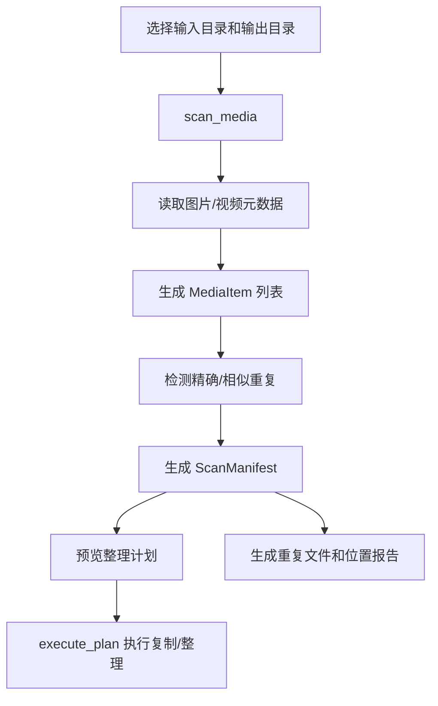

# Windows 实用工具箱项目交接文档

> 目标读者：第一次接手本项目的人类开发者或后续 AI Agent。读完这份文档，应能快速知道项目做什么、入口在哪里、核心模块怎么分工、如何运行/打包、哪些坑不能踩。

## 1. 项目一句话概览

`Windows 实用工具箱` 是一个面向 Windows 的本地桌面工具集合，主程序使用 `Tkinter` 编写，通过 `PyInstaller` 打包成单文件可执行程序。它把多个日常 Windows 小工具整合在一个窗口里，包括批量重命名、窗口置顶、存档备份、视频字幕同步、音频输出切换、直播快捷入口、系统工具、开机自启动、拖拽关闭应用、照片视频整理，以及一个独立的麦克风状态悬浮窗助手。

当前本机工作目录：

```text
C:\Users\User\Desktop\Python\工具箱
```

GitHub 仓库：

```text
https://github.com/1972863663/utility-toolbox.git
```

主程序源码：

```text
utility_toolbox.py
```

主程序打包配置：

```text
UtilityToolbox.spec
```

本机已生成的可执行文件：

```text
工具箱.exe
```

注意：`工具箱.exe`、`dist/`、`build/`、`mic_tool_workspace/` 在 `.gitignore` 中被忽略，默认不会上传到 GitHub。GitHub 主要保存源码、图标、测试和打包配置。

## 2. 目录结构速查

```text
工具箱/
├─ utility_toolbox.py              # 主 Tkinter 工具箱应用，绝大多数功能都在这里
├─ subtitle_sync_embedded.py       # 嵌入主工具箱的视频字幕同步工具
├─ UtilityToolbox.spec             # 主工具箱 PyInstaller 打包配置
├─ README.md                       # 项目简要说明
├─ docs/
│  └─ PROJECT_HANDOFF.md           # 当前这份交接文档
├─ icons/
│  └─ utility_toolbox.ico          # 主程序图标
├─ media_organizer/                # 照片视频管家模块
│  ├─ app.py                       # PyQt 版本独立窗口入口/界面代码
│  ├─ metadata.py                  # 图片/视频 EXIF、GPS、设备、日期提取
│  ├─ models.py                    # AppConfig、MediaItem、DuplicateGroup、ScanManifest 数据模型
│  ├─ organizer.py                 # 按扫描计划执行复制/整理
│  ├─ reports.py                   # 重复文件、位置报告输出
│  ├─ scanner.py                   # 扫描媒体、计算目标路径、重复检测
│  ├─ utils.py                     # hash、路径安全、JSON 工具
│  └─ video.py                     # 视频压缩辅助
├─ mic_toggle/
│  ├─ 一键麦克风开关.py              # 独立麦克风悬浮窗源码
│  └─ 一键麦克风开关.spec            # 麦克风悬浮窗打包配置
├─ test_autostart.py               # 开机自启动路径修复测试
├─ test_launcher_close.py          # 拖拽关闭/进程匹配测试
├─ build/                          # PyInstaller 构建缓存，忽略
├─ dist/                           # PyInstaller 输出，忽略
├─ mic_tool_workspace/             # 本机麦克风助手构建工作区，忽略
├─ 工具箱.exe                       # 本机主程序成品，忽略
└─ 工具箱_桌面旧版.exe               # 本机旧版备份，忽略
```

## 3. 核心运行方式

### 3.1 直接用源码运行

在项目根目录执行：

```powershell
python utility_toolbox.py
```

主入口在 `utility_toolbox.py` 底部：

```python
def main() -> int:
    configure_dpi_awareness()
    ...
```

### 3.2 打包主工具箱

```powershell
python -m PyInstaller UtilityToolbox.spec --noconfirm
```

输出文件：

```text
dist\UtilityToolbox.exe
```

本机通常会再复制成：

```text
工具箱.exe
```

### 3.3 打包麦克风悬浮窗助手

源码和 spec 在：

```text
mic_toggle\一键麦克风开关.py
mic_toggle\一键麦克风开关.spec
```

常见输出位置是：

```text
mic_tool_workspace\dist\一键麦克风开关.exe
```

主工具箱的“系统工具 → 启动麦克风悬浮窗”会优先从这些候选路径查找：

```text
一键麦克风开关.exe
mic_tool_workspace\dist\一键麦克风开关.exe
mic_tool_workspace\dist\Ò»¼üÂó¿Ë·ç¿ª¹Ø.exe
%USERPROFILE%\Documents\工具箱\mic_tool_workspace\dist\一键麦克风开关.exe
%USERPROFILE%\Documents\工具箱\mic_tool_workspace\dist\Ò»¼üÂó¿Ë·ç¿ª¹Ø.exe
```

最后两个旧路径是历史兼容项；项目当前已迁移到 `C:\Users\User\Desktop\Python\工具箱`，如后续清理路径，建议保留当前目录相对路径优先项。

## 4. 主程序架构

`utility_toolbox.py` 是一个单文件 Tkinter 应用。整体结构是：

1. 顶部：导入、常量、主题、Windows API 辅助函数。
2. 中部：每个工具页对应一个类。
3. 底部：`UtilityToolbox` 组合所有 tab，并进入 `mainloop()`。

### 4.1 主要类和功能映射

| 类/模块 | 位置 | 责任 |
|---|---:|---|
| `DateRenamerTab` | `utility_toolbox.py` | 批量重命名：选择文件夹、预览、执行、撤回。 |
| `TopmostController` | `utility_toolbox.py` | 窗口置顶控制：枚举窗口、切换置顶、取消置顶。 |
| `DropCloseController` | `utility_toolbox.py` | 拖拽文件/快捷方式后匹配并关闭相关进程。 |
| `TrayIcon` | `utility_toolbox.py` | 系统托盘菜单、打开/隐藏工具箱、退出、置顶快捷项。 |
| `BackupMonitorTab` | `utility_toolbox.py` | 存档/文件夹备份监控。 |
| `AudioSwitchTab` | `utility_toolbox.py` | 默认音频输出设备切换，使用 Windows Core Audio COM 接口。 |
| `LiveShortcutTab` | `utility_toolbox.py` | 直播快捷入口，自动打开配置项。 |
| `SystemToolsTab` | `utility_toolbox.py` | 系统工具：管理员 PowerShell、启动/关闭麦克风悬浮窗。 |
| `StartupTab` | `utility_toolbox.py` | 开机启动配置，写入 Windows Run 注册表项。 |
| `LauncherTab` | `utility_toolbox.py` | 应用启动器，支持拖拽启动并按路径关闭进程。 |
| `MediaOrganizerTab` | `utility_toolbox.py` | 照片视频管家嵌入页，调用 `media_organizer` 扫描/整理逻辑。 |
| `UtilityToolbox` | `utility_toolbox.py` | 主窗口，创建 `ttk.Notebook` 并挂载所有功能页。 |

### 4.2 主界面 tab 顺序

主窗口使用 `ttk.Notebook`，当前 tab 大致包括：

1. 批量重命名
2. 窗口置顶
3. 存档备份
4. 视频字幕同步
5. 音频输出
6. 直播快捷
7. 系统工具
8. 自启动
9. 应用启动器
10. 照片视频管家

对应代码在 `UtilityToolbox.__init__()` 附近。

## 5. 关键功能说明

### 5.1 批量重命名

入口类：`DateRenamerTab`

能力：

- 选择文件夹。
- 按“日期+序号”等规则生成目标文件名。
- 预览重命名结果。
- 执行重命名。
- 撤回上次操作。

注意点：

- 这类文件操作必须保持“先预览，后执行”的交互，不要改成无确认批量改名。
- 撤回依赖运行期记录，重启后不应假设仍可撤回。

### 5.2 窗口置顶

入口类：`TopmostController`

能力：

- 枚举可见窗口。
- 切换指定窗口置顶状态。
- 支持热键切换当前前台窗口。
- 支持取消所有由本工具设置的置顶窗口。

注意点：

- 管理员权限窗口可能无法由普通权限工具箱控制。
- 如果置顶失败，优先考虑权限级别不一致。

### 5.3 拖拽关闭应用 / 应用启动器

相关类：`DropCloseController`、`LauncherTab`

核心思路：

- 用户把 `.exe`、`.bat`、`.cmd`、`.py`、`.ps1`、`.lnk` 或目录拖进工具箱。
- 工具箱解析路径或快捷方式目标。
- 枚举运行中进程，按可执行文件路径或目录作用域匹配。
- 调用 `taskkill` / Windows API 结束匹配进程。

一键启动路径修复：

- 启动器保存的主路径是绝对路径，文件移动后原路径会失效。
- `LauncherTab` 现在提供“修复失效路径”按钮。
- 用户点“启动选中”或“启动当前组”时，如果原路径不存在，会自动尝试按文件名搜索新位置。
- 找到新位置后会更新 `launcher.json` 里的 `path` 字段，并刷新列表；以后启动直接走新路径。
- 搜索范围优先包括原路径附近、桌面、文档、下载、当前项目目录和本机盘符根目录；会跳过 Windows、Program Files、AppData、缓存、`.git`、`node_modules` 等高风险/高噪声目录。
- 单个项目自动修复搜索有时间上限，避免点启动后无限卡住。

相关测试：

```powershell
python -m pytest test_launcher_close.py
```

注意点：

- 进程匹配逻辑非常容易误杀，修改时必须跑 `test_launcher_close.py`。
- `DIRECTORY_SCOPE_KEYWORDS` 用来判断目录是不是启动器/运行器目录，不要随便扩大匹配范围。

### 5.4 开机自启动

相关函数/类：

- `autostart_command()`
- `read_autostart_command()`
- `set_autostart()`
- `is_autostart_enabled()`
- `repair_autostart_path()`
- `StartupTab`

注册表位置：

```text
HKCU\Software\Microsoft\Windows\CurrentVersion\Run
```

Run value name：

```text
UtilityToolbox
```

相关测试：

```powershell
python -m pytest test_autostart.py
```

迁移目录后要特别注意：

- 如果旧自启动指向 `C:\Users\User\Documents\工具箱\工具箱.exe`，需要修复到新路径。
- `repair_autostart_path()` 的作用就是处理“程序移动后自启动路径失效”的情况。

### 5.5 麦克风悬浮窗

主工具箱入口：`SystemToolsTab`

独立助手源码：

```text
mic_toggle\一键麦克风开关.py
```

主工具箱按钮：

- “启动麦克风悬浮窗”
- “关闭麦克风悬浮窗”

历史问题：

- 麦克风悬浮窗是鼠标穿透窗口，设计上不挡游戏/桌面点击。
- 这也导致它卡住时用户可能无法通过鼠标关掉。
- 2026-07-04 已在 `SystemToolsTab` 中新增“关闭麦克风悬浮窗”按钮。

关闭逻辑：

- 扫描 `一键麦克风开关.exe` 和历史乱码名 `Ò»¼üÂó¿Ë·ç¿ª¹Ø.exe`。
- 找到后优先通过 Windows API `TerminateProcess` 结束。
- 如果权限不足，则用 `ShellExecuteW(..., "runas", "taskkill.exe", ...)` 弹出 UAC 进行管理员关闭。

注意点：

- 不要把悬浮窗改回普通可点击窗口，否则会破坏“不挡游戏点击”的原始设计目标。
- 如果要给悬浮窗做 UI 关闭入口，必须同时保留主工具箱里的强制关闭按钮。

### 5.6 视频字幕同步

入口：主工具箱的“视频字幕同步”页。

代码：

```text
subtitle_sync_embedded.py
```

用途：

- 面向本地视频/字幕文件。
- 提供字幕同步、批处理、停止任务、日志显示等能力。

注意点：

- 这是嵌入式工具，不是 `media_organizer` 的一部分。
- 修改 UI 时注意 Tkinter 线程安全，后台任务更新界面应通过 `after()` 或封装的 safe UI 方法。

### 5.7 照片视频管家

主工具箱入口类：`MediaOrganizerTab`

核心模块：`media_organizer/`

典型流程：



模块职责：

- `metadata.py`：提取 EXIF、GPS、拍摄日期、设备信息。
- `scanner.py`：遍历媒体文件，生成整理目标路径，检测重复。
- `organizer.py`：按 manifest 执行复制/整理。
- `reports.py`：输出 CSV/HTML 报告。
- `models.py`：保存核心 dataclass。

注意点：

- 整理媒体文件时优先复制，不要默认移动/删除原文件。
- GPS、拍摄设备等信息可能缺失，UI 和报告必须能处理空值。
- HEIC/HEIF 支持依赖 `pillow_heif`，打包时注意 hidden imports / data files。

## 6. 依赖和打包注意事项

项目没有单独的 `requirements.txt`。从源码和 spec 看，主要依赖包括：

- Python 3.12 当前本机环境可用。
- `pywin32`：`win32api`、`win32con`、`win32gui`、`win32process`、`win32com.client`。
- `tkinterdnd2`：拖拽支持。
- `keyboard`：热键相关。
- `pyautogui`：直播快捷入口自动点击等。
- `Pillow` / `PIL`。
- `imagehash`。
- `pillow_heif`。
- `PyQt5`：`media_organizer/app.py` 独立 PyQt 窗口使用；主工具箱内嵌页主要走 Tkinter。
- `pytest`：运行测试。
- `PyInstaller`：打包。

`UtilityToolbox.spec` 里已经显式包含部分 hidden imports：

```python
hiddenimports=[
    'keyboard',
    'pyautogui',
    'imagehash',
    'pillow_heif',
    'win32com.client',
    'tkinterdnd2',
    'tkinterdnd2.TkinterDnD',
]
```

打包时如果新增第三方库，优先更新 `UtilityToolbox.spec`，不要只在本机装包然后忘记打包配置。

## 7. 常用开发命令

### 7.1 查看工作区状态

```powershell
git status -sb
git remote -v
git log -1 --oneline
```

### 7.2 语法检查

```powershell
python -m py_compile utility_toolbox.py
python -m py_compile subtitle_sync_embedded.py
python -m py_compile mic_toggle\一键麦克风开关.py
```

### 7.3 运行测试

```powershell
python -m pytest test_launcher_close.py test_autostart.py
```

### 7.4 打包

```powershell
python -m PyInstaller UtilityToolbox.spec --noconfirm
```

### 7.5 推送到 GitHub

```powershell
git add <changed-files>
git commit -m "Your concise message"
git push origin main
```

当前仓库直接使用 `main` 分支；这不是大型协作仓库，用户通常要求的是直接更新 GitHub，而不是开 PR。

## 8. 重要维护规则

### 8.1 不要误删/误杀

这个工具箱有不少功能会操作本地文件和进程。改动时必须守住这些边界：

- 文件批量操作必须有预览或明确用户动作。
- 拖拽关闭应用的进程匹配必须保守。
- 不要把目录匹配做成“路径包含就杀”，否则可能误杀一大片进程。
- 删除旧目录前必须确认目录为空；递归删除前必须确认绝对路径。

### 8.2 不要把本机产物上传成源码

以下是本机产物或构建缓存，通常不进 Git：

```text
工具箱.exe
工具箱_桌面旧版.exe
build/
dist/
mic_tool_workspace/
__pycache__/
.pytest_cache/
```

`.gitignore` 已经覆盖这些路径。

### 8.3 迁移路径后的坑

项目已从旧路径：

```text
C:\Users\User\Documents\工具箱
```

迁移到新路径：

```text
C:\Users\User\Desktop\Python\工具箱
```

后续如果用户说“工具箱路径”，优先使用新路径。旧路径可能只剩空目录，或者被 Codex/终端进程短暂占用。

如果打包后的 `工具箱.exe` 被移动，开机自启动注册表可能仍指向旧路径，应通过自启动页刷新/修复，或检查：

```powershell
reg query HKCU\Software\Microsoft\Windows\CurrentVersion\Run /v UtilityToolbox
```

### 8.4 修改麦克风悬浮窗时的坑

- 悬浮窗需要鼠标穿透，这是为了不挡游戏/桌面点击。
- 如果用户说“悬浮窗关不掉”，优先处理主工具箱里的“关闭麦克风悬浮窗”按钮，而不是要求用户去点悬浮窗。
- 如果存在多个 `一键麦克风开关.exe`，关闭按钮应全部处理。
- 管理员权限不一致时，要么以管理员运行工具箱，要么保留 UAC fallback。

### 8.5 修改 UI 时的坑

- Tkinter UI 更新必须在主线程。
- 后台线程更新界面时用 `root.after(...)`。
- 主题和缩放使用已有的 `THEME`、`current_scale()`、`scaled()`，不要硬塞一套风格。
- 代码里已经有大量中文 UI 文案，新增文案保持简洁直白。

## 9. 当前已知状态

截至 2026-07-05：

- 主项目位置：`C:\Users\User\Desktop\Python\工具箱`。
- GitHub remote：`https://github.com/1972863663/utility-toolbox.git`。
- 最新已知提交包含“关闭麦克风悬浮窗”按钮：`9dd2134 Add mic overlay close button`。
- `README.md` 是简要说明；本文件是详细交接文档。
- 旧路径 `C:\Users\User\Documents\工具箱` 可能曾被 Codex/Node REPL 占用导致空目录暂时删不掉，不代表项目还在那里。

## 10. 接手者最快上手路线

如果你只有 10 分钟接手，按这个顺序：

1. 看 `README.md`，知道项目是什么。
2. 看本文件的第 2、4、5 节，知道目录和功能映射。
3. 运行：

   ```powershell
   python -m py_compile utility_toolbox.py
   python -m pytest test_launcher_close.py test_autostart.py
   ```

4. 如果要改主界面，打开 `utility_toolbox.py`，先找对应的 `*Tab` 类。
5. 如果要改照片视频管家，先看 `media_organizer/models.py` 和 `media_organizer/scanner.py`。
6. 如果要改麦克风悬浮窗，先看 `SystemToolsTab` 和 `mic_toggle\一键麦克风开关.py`。
7. 改完后跑测试，再打包：

   ```powershell
   python -m PyInstaller UtilityToolbox.spec --noconfirm
   ```

## 11. 建议的后续整理项

这些不是当前必须做，但后续接手者可以考虑：

1. 新增 `requirements.txt` 或 `pyproject.toml`，把依赖从隐式本机环境变成显式项目配置。
2. 把 `utility_toolbox.py` 拆分成多个模块；当前单文件接近十万字符，继续堆功能会越来越难维护。
3. 为 `media_organizer` 增加单元测试，尤其是日期解析、GPS 解析、重复检测和目标路径生成。
4. 为麦克风悬浮窗补一个轻量 IPC 或命令行参数，例如 `--quit-existing`，让主工具箱能优雅通知它退出，而不是只能强杀。
5. 清理历史兼容乱码文件名 `Ò»¼üÂó¿Ë·ç¿ª¹Ø.exe` 的依赖，但清理前必须确认用户机器上不再存在旧构建产物。
